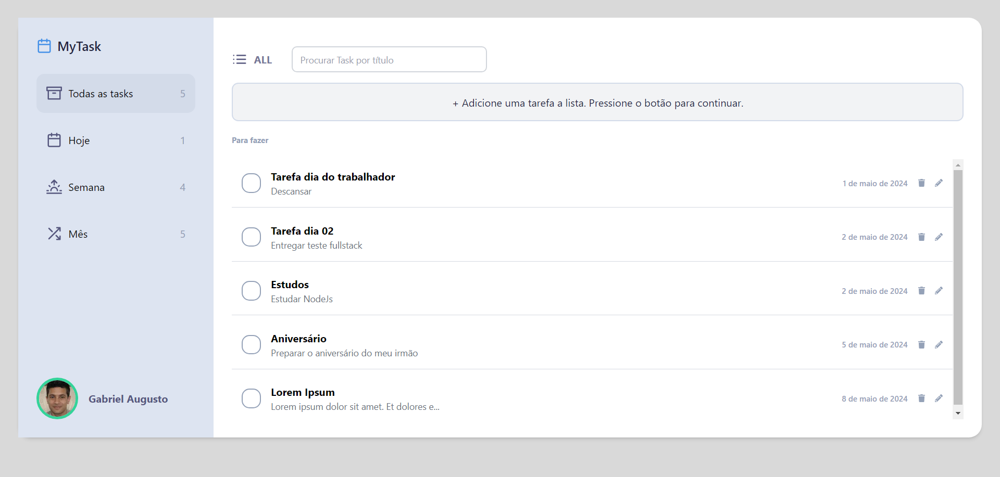

## Calendar Task

This project is a Single Page Application (SPA) of a daily task calendar.

## Getting Started

1. First, run the api server [Calendar Task API](https://github.com/gabriel-afg/TaskCalendar_Backend):

2. Run the development server

```bash
npm run dev
# or
yarn dev
# or
pnpm dev
# or
bun dev
```

3. Open [http://localhost:3000](http://localhost:3000) with your browser to see the result.



## Contributing

Contributions are welcome! If you find any issues or have suggestions for improvements, please open an issue or submit a pull request to the repository.
